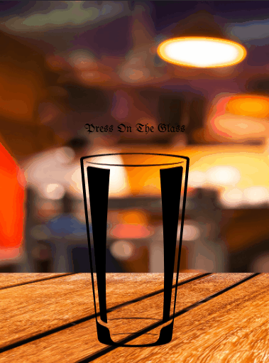

# Beer for Beerpong :beer:
You can search beer to play beer pong :beers::ping_pong:

**You sink it, they drink it**

## [LINK](https://upschool-beerpong.vercel.app/)

## Technologies :rocket:
- React
- React Router Dom
- [Beer Animation](https://speckyboy.com/css-glassmorphism/)
- Bootstrap 5
- React Paginate
- React Icons
- Ant Design - Slider


## Previews

- Desktop


- Mobile



## How to install

```bash
git pull https://github.com/mervekrblt/upschool-beerpong.git

npm install

npm start
```

